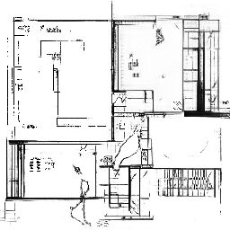
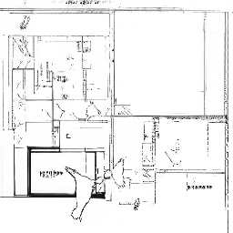
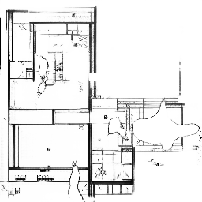

# Arch-Ai-Tex  
## House-Floor-Generator

<h1 align="center">
  <a href="https://aravkataria.github.io/Arch-Ai-Tex/">Arch-Ai-Tex</a>
</h1>

<p align="center">
  
  
  
  
</p>

## Table of Contents  
1. [Project Overview](#project-overview)  
2. [Motivation](#motivation)  
3. [Workflow Overview](#workflow-overview)  
4. [Tech Stack](#tech-stack)  
5. [Key Features](#key-features)  
6. [Architecture & Methods](#architecture--methods)  
   - [Model Architecture](#model-architecture)  
   - [Loss Functions & Training Details](#training-details)  
   - [Dataset & Preprocessing](#dataset--preprocessing)  
   - [Resolution / Output Details](#resolution--output-details)  
7. [Usage / Running the Project](#usage--running-the-project)  
   - [Training](#training)  
   - [Programming of Electronic Components](#programming-of-electronic-components)  
   - [Generating Floor Plans](#generating-floor-plans)  
   - [Viewing Results](#viewing-results)  
8. [Features Explained](#features-explained)  
   - [GAN Floorplan Generator](#gan-floorplan-generator)  
   - [Optimized Layout Generator](#optimized-layout-generator)  
   - [Real-Time Sensor Dashboard](#real-time-sensor-dashboard)  
   - [Segmentation Model](#segmentation-model)  
9. [Results & Visualizations](#results--visualizations)  
10. [Future Enhancements](#future-enhancements)  
11. [Key Learnings](#key-learnings)  
12. [Installation Instructions](#installation-instructions)  
13. [deployment](#deployment)  

---

## Project Overview  
This project implements a **deep generative model** to create realistic **house floor plans** automatically.  
It combines **GAN-based architecture** and **Random Forest regression** for estimating room area distributions.  
The final output is a high-resolution, architecturally coherent layout image.

The system can be extended for **conditional generation** (e.g., based on the number of rooms or length and breadth), serving as an **AI design assistant** for architects and planners.

The goal is to help architects, designers, and hobbyists quickly prototype layout ideas.

This system also supports **Optimized Layout Generation** and a **Real-Time Sensor Dashboard**.  
The **Optimized Layout Generation** module generates a rough layout based on dimensions, number of rooms, property type, and plot shape.  
The **Real-Time Sensor Dashboard** captures house dimensions using ultrasonic and motion sensors and generates a new layout using a **GAN-based generator**.

## Motivation  
- Creating floor plans manually is time-consuming and requires domain knowledge in architecture.  
- With generative models, one can **automate** the creation of many candidate layouts, speeding up the design exploration process.  
- By analyzing the **layout space**, designers can draw inspiration from machine-generated designs and refine them.  
- This project also serves an academic interest in understanding how deep networks handle spatial/layout generation, generalization of designs, and evaluation of architecture-associated outputs.

## Workflow Overview
The complete Arch-Ai-Tex workflow integrates multiple modules in a single pipeline:

1. **Input Stage:** The user provides layout parameters manually or via real-time sensor data.  
2. **Generation Stage:**  
   - *GAN Floorplan Generator* produces high-quality floor plan images.  
   - *Optimized Layout Generator* computes rule-based layouts for constraint-based design.  
3. **Segmentation Stage:** The generated plan is passed through the segmentation model to identify walls and structures.  
4. **Visualization Stage:** Results are displayed in the Streamlit interface with options for denoising, optimization, and real-time regeneration.

This modular design enables flexibility — users can run any stage independently or as part of an integrated workflow.

## Tech Stack
- **Programming Language:** Python 3.10  
- **Frontend / UI:** Streamlit  
- **Deep Learning Framework:** PyTorch  
- **ML / Regression:** scikit-learn (Random Forest)  
- - **Hardware Integration:** Arduino Mega 2560, ESP32, HC-SR04 Ultrasonic Sensor, HC-SR501 PIR Sensor, IR Sensor
- **Visualization:** Matplotlib, OpenCV  

## Key Features  
- Generate floor plans given random/noise input (or conditional input, e.g., number of rooms).  
- Visualize and compare generated designs versus dataset samples.  
- Web app interface to input parameters (number of rooms, square footage, style) and output downloadable floor plan PNGs.  
- Optional denoiser for better image quality.  
- Real-Time Sensor Dashboard for capturing dimensions and automatically generating outputs using sensors.  
- Optimized Layout Generation for logical room placement based on user-defined input features.  
- Segmentation model to produce wall-highlighted images for better visualization.  

## Architecture & Methods  

### Model Architecture  
- **Generator:**  
  The generator is one of two neural networks in a GAN system that competes against a discriminator network to create new, realistic data. The generator takes random noise as input and tries to produce synthetic data that is so convincing the discriminator cannot tell it apart from real data in the original training set. Through this adversarial process, the generator continuously improves its ability to generate authentic-looking outputs.  
  Example: Takes a 100-dimensional latent vector *z*, passes through fully connected + reshape layers, followed by several transposed convolution layers with BatchNorm and ReLU activations, producing an output image of size 256×256.  

```math
\mathcal{L}_G
=
-\mathbb{E}_{z \sim p_z(z)}
\left[
\log D(G(z))
\right]
```

- **Discriminator:**  
  The discriminator acts as a binary classifier that helps distinguish between real and generated data. It learns to improve its classification ability through training, refining its parameters to detect fake samples more accurately. When dealing with image data, it uses convolutional layers and LeakyReLU activations to extract meaningful features.

  ```math
  \mathcal{L}_D
  =
  -\frac{1}{2}
  \left[
  \mathbb{E}_{x \sim p_{\text{data}}(x)}
  \left[\log D(x)\right]
  +
  \mathbb{E}_{z \sim p_z(z)}
  \left[\log\left(1-D(G(z))\right)\right]
  \right]

- **Circuit:**  
  The Real-Time Sensor Dashboard uses different sensors to identify distance and other parameters.  
  We used components like Arduino Mega 2560, ESP32, HC-SR04 Ultrasonic sensor, HC-SR501 PIR sensor, and an IR sensor, with the ESP32 transmitting data via Wi-Fi. 
  Data is processed through the Arduino Mega 2560 and then transferred wirelessly by the ESP32.  

### Training Details  
- Optimizer: Adam (lr=0.0002, β₁=0.5, β₂=0.999)  
- Batch size: 8  
- Number of epochs: 100  

### Dataset & Preprocessing  
- Preprocessing steps:  
  - Grayscale image generation.  
  - Resize all images to 256×256.  
  - Normalize pixel values to [-1,1].  
- For room prediction:  
  - Split dataset into training and validation sets (e.g., 80% training, 20% validation).

### Resolution / Output Details  
- Output resolution: 256×256.  
- Images saved as `.png`.  
- Optional denoising per user input.  
- Segmentation model for structural clarity.  
- Auto room layout from Optimized Layout Generator.  

## Usage / Running the Project

### Training
To train the GAN or Random Forest models from scratch, run the respective training scripts [floor_generater.py](floor_generater.py) and [room_predictor.py](room_predictor.py).  
The [floor_generater.py](floor_generater.py) script saves `generator.pth`, `discriminator.pth`, and sample images every 10 epochs and checkpoints every epoch.  
The [room_predictor.py](room_predictor.py) script saves the `room_predictor.joblib` model after training.  

### Programming of Electronic Components
To program the electronic components for the Real-Time Sensor Dashboard, program the Arduino Mega and ESP32 with [mega.ino](mega/mega.ino) and [esp32.ino](esp32/esp32.ino) respectively.  
These send data in real time to a database via [server.py](server.py) with a delay of ~15 seconds when connected to Wi-Fi.  

### Generating Floor Plans
To generate a new floor plan, run [main.py](main.py), [app.py](app.py), or use the deployed site at [Arch-Ai-Tex Streamlit App](https://arch-ai-tex.streamlit.app/).  

Follow the prompts to enter:  
**Common Prompts:**  
- Length (m)  
- Width (m)  
- Number of bedrooms  

**For GAN-generated images:**  
- Whether to apply denoiser (y/n)  

**For Optimized Layout:**  
- Property Type  
- Plot Shape  

### Viewing Results
Generated floor plans are saved to the specified output path in `.png` format.  

## Features Explained

### GAN Floorplan Generator
The GAN Floorplan Generator produces realistic floor plan layouts from random noise or user-defined inputs such as the number of rooms, dimensions, and style preferences.  
It uses the trained [generator model](generator_epoch100.pth) to synthesize new layouts and can optionally apply a denoiser for enhanced clarity.  
Each output is generated at 256×256 resolution and can be visualized or segmented for wall detection and layout analysis.  

Once trained, the generator can be accessed via the [web app](app.py) or [deployed](https://arch-ai-tex.streamlit.app/) under GAN Generator.  

### Optimized Layout Generator
The Optimized Layout Generator creates structured floor plans based on user-defined parameters such as plot dimensions, number of rooms, property type, and plot shape.  
It leverages Random Forest Regression and heuristic algorithms to estimate logical room arrangements, focusing on functionality and spatial efficiency.  
This module is best suited for constraint-based design needs.  

The Optimized Layout module can be accessed via the [web app](app.py) or [deployed](https://arch-ai-tex.streamlit.app/) under “Optimized Layout Generator.”  

### Real-Time Sensor Dashboard
The Real-Time Sensor Dashboard connects IoT sensors (HC-SR04 Ultrasonic, IR Sensor and HC-SR501 PIR) with Arduino Mega 2560 and ESP32 modules to capture dimensions in real time.  
Captured data is transmitted via Wi-Fi and automatically used to generate new layouts through the GAN model.  

The Real-Time Sensor Dashboard can be accessed via the [web app](app.py) or [deployed](https://arch-ai-tex.streamlit.app/) under “Real-Time Sensor Dashboard.”  

### Segmentation Model
The Segmentation Model enhances generated layouts by identifying walls and boundaries.  
It uses PyTorch’s pre-trained FCN-ResNet50, fine-tuned for floor plan segmentation.  
After a plan is generated, it produces a binary mask that highlights structural boundaries.  

The Segmentation Model is available in the [web app](app.py) or [deployed](https://arch-ai-tex.streamlit.app/) under GAN Floorplan Generator and Real-Time Sensor Dashboard.  

## Results & Visualizations
Here are examples of floor plans generated by the GAN model:  

      

## Future Enhancements
- Integrate multi-room segmentation (labeling bedroom, kitchen, hall, etc.).  
- Add conditional GANs for style-specific or multi-level floor plan generation.  
- Implement database logging for continuous sensor data recording.  
- Support 3D visualization of generated layouts using Blender or Three.js.  
- Extend IoT integration for temperature or light mapping.  

## Key Learnings
- Integration of deep learning models with real-world IoT data.  
- Design of an end-to-end AI architecture from training to deployment.  
- Trade-offs between data-driven (GAN) and rule-based (Optimization) approaches.  
- Development in Streamlit UI, Arduino-ESP32 communication, and model deployment.  

## Installation Instructions
Follow these steps to set up the project locally: 

1. Clone the Repository
   
          git clone https://github.com/AravKataria/Arch-Ai-Tex.git
          cd Arch-Ai-Tex
2. Set up the Environment
   
          python -m venv venv
          venv\Scripts\activate
3. Install requirements

            pip install -r requirements.txt
4. Run the Script
   
         main.py
         app.py
   
## Deployment
The project is deployed online at 

[[Arch-Ai-Tex](https://aravkataria.github.io/Arch-Ai-Tex/)] (non streamlit site with all the features except 3d modeling)

[[Arch-Ai-Tex](https://arch-ai-tex-new.streamlit.app/)] (basic; can only Generate floor plans given input, Optimized Layout Generation, and Segmentation model)

[[Arch-Ai-Tex](https://arch-ai-tex.streamlit.app/)] (more advance features; can do everything as the basic and also has a integrated chatbot, Real-Time Sensor Dashboard, and real-time 3d modeling)
